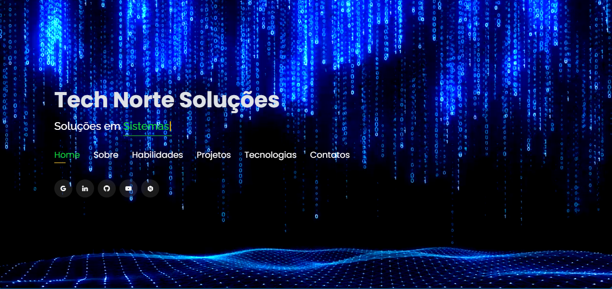

# 🌐 Portfólio — Carlos Jorge Sarmento Neto  

Bem-vindo(a) ao meu portfólio! 🚀  
Aqui apresento alguns dos projetos que desenvolvi e compartilho um pouco sobre minha trajetória como **desenvolvedor de sites, web systems e soluções criativas em tecnologia**.  

A proposta do meu trabalho é **ajudar empresas e empreendedores a expandirem sua presença digital**, oferecendo soluções personalizadas e modernas, com foco em **inovação, performance e usabilidade**.  

🔗 **Confira meu portfólio online:** [netosarmento.github.io](https://technortesolucoes.com.br/)  

---

## 🛠️ Tecnologias utilizadas  

- **Frontend:** HTML, CSS, PHP e JavaScript  
- **Design Responsivo:** foco em acessibilidade e experiência do usuário  
- **Versionamento:** Git & GitHub Pages para deploy  
- **Outras stacks em uso em projetos:** React.js, Firebase, Node.js  

---

## 📸 Screenshots  

  
    

  

---

## 👤 Autor  

**Carlos Jorge Sarmento Neto**  

📎 [LinkedIn](https://www.linkedin.com/in/carlos-jorge-sarmento-neto-1689a084/)  
💻 [GitHub](https://github.com/netosarmento)  
✉️ E-mail: **[netosarmento@gmail.com](mailto:netosarmento@gmail.com)**  
